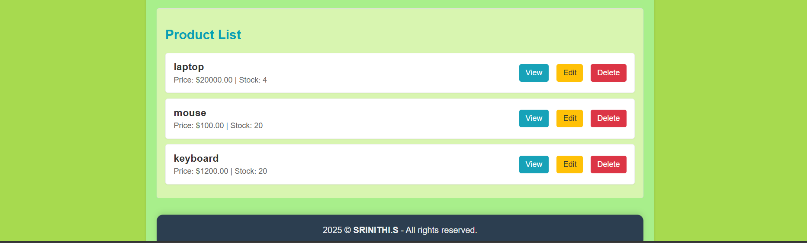
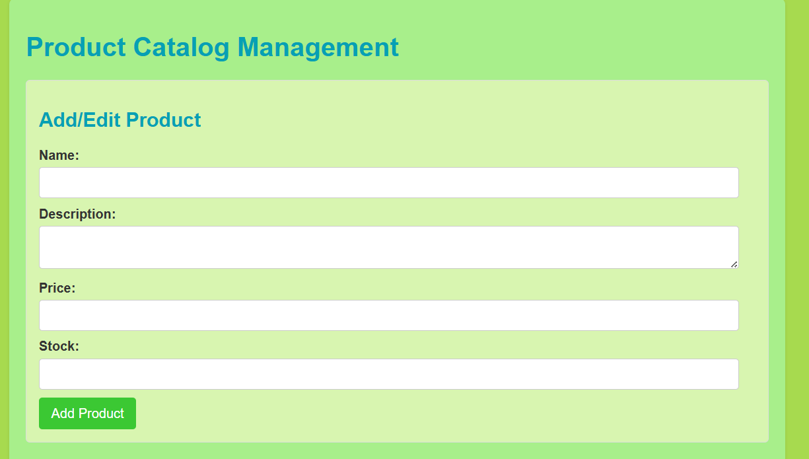
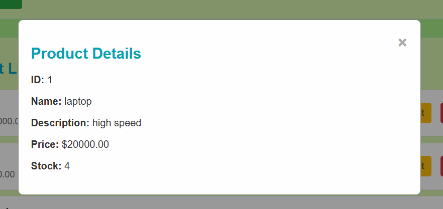
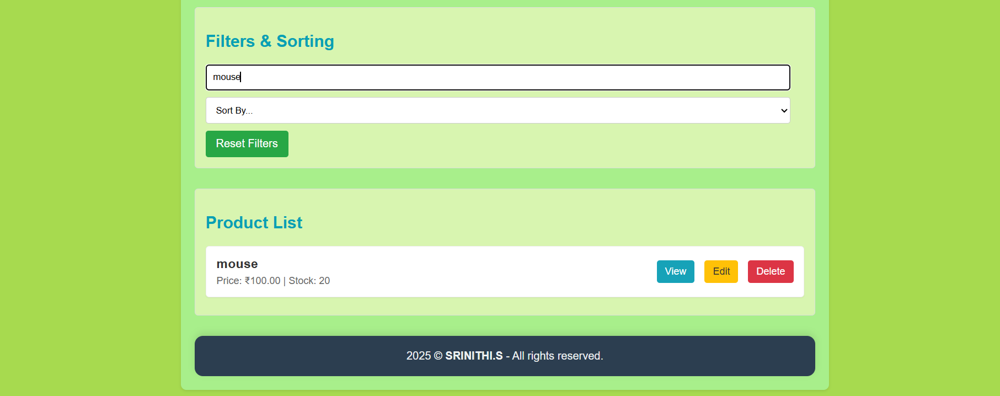

# Product Catalog Management Application

This is a simplified web application for managing a product catalog, built with a Python (Flask) backend API and a HTML, CSS, and JavaScript frontend. It allows users to perform CRUD (Create, Read, Update, Delete) operations on product data, along with client-side filtering and sorting.

# Table of Contents

* [Features](#features)
* [Technologies Used](#technologies-used)
* [Project Structure](#project-structure)
* [Setup and Installation](#setup-and-installation)
    * [Prerequisites](#prerequisites)
    * [Backend Setup](#backend-setup)
    * [Frontend Setup](#frontend-setup)
* [How to Run the Application](#how-to-run-the-application)
* [Key Functionalities (Screenshots)](#key-functionalities-screenshots)
* [License](#license)

## Features

**Backend (Flask API):**
* RESTful API for product management (GET, POST, PUT, DELETE /products).
* SQLite database managed by SQLAlchemy ORM.
* Basic error handling and input validation.
* CORS enabled for frontend communication.

**Frontend (HTML, CSS, JavaScript):**
* Displays a list of all products.
* Form to add new products.
* Ability to edit existing product details.
* View detailed information for individual products in a modal.
* Delete products.
* **Client-side Filtering:** Filter products by name or description.
* **Client-side Sorting:** Sort products by name, price, or stock (ascending/descending).

## Technologies Used

* **Backend:**
    * Python 3.x
    * Flask (Web Framework)
    * Flask-SQLAlchemy (ORM for database interaction)
    * Flask-CORS (for Cross-Origin Resource Sharing)
    * SQLite (Database)
* **Frontend:**
    * HTML5
    * CSS3
    * JavaScript (ES6+)
    * Fetch API (for communicating with the backend)

## Project Structure
product_catalog_app/backend/app.py        # Flask application and API endpoints
   ||backend/models.py     # SQLAlchemy database model definition
   ||backend/database.db   # SQLite database file (auto-generated on first run)
||product_catalog_app/frontend/index.html    # Main user interface
 || frontend/style.css     # Styling for the frontend  
  ||frontend/script.js     # Frontend logic and API interactions
  ||product_catalog_app/screenshots     # Folder containing application screenshots
  ||product_catalog_app/.gitignore      # Specifies files/folders to be ignored by Git
  ||product_catalog_app/ README.md      # This file

## Setup and Installation

### Prerequisites

* Python 3.6+ installed on your system.
* A web browser (Chrome, Firefox, Edge, etc.).
* A terminal or command prompt.

### Backend Setup

1.  **Navigate to the project directory:**
    ```bash
    cd product_catalog_app/backend
    ```

2.  **Create a Python Virtual Environment:**
    ```bash
    python -m venv venv
    ```

3.  **Activate the Virtual Environment:**
    * **On macOS/Linux:**
        ```bash
        source venv/bin/activate
        ```
    * **On Windows (Command Prompt):**
        ```cmd
        venv\Scripts\activate
        ```
    * **On Windows (PowerShell):**
        ```powershell
        .\venv\Scripts\Activate.ps1
        ```
        *(If you encounter a `SecurityError` on PowerShell, run PowerShell as Administrator and execute `Set-ExecutionPolicy RemoteSigned -Scope CurrentUser`, then open a new regular PowerShell window and try again.)*

4.  **Install Required Python Libraries:**
    ```bash
    pip install Flask Flask-SQLAlchemy Flask-CORS
    ```

### Frontend Setup

No specific installation steps are needed for the frontend beyond having a web browser. The necessary HTML, CSS, and JavaScript files are included in the `frontend/` directory.

## How to Run the Application

To run the application, you need to start both the backend server and open the frontend in your browser.

1.  **Start the Backend Server:**
    * Open your first terminal/command prompt.
    * Navigate to the `backend` directory and activate your virtual environment (if not already active).
    * Run the Flask application:
        ```bash
        python app.py
        ```
    * You should see output indicating the server is running on `http://127.0.0.1:5000`. Keep this terminal window open.

2.  **Open the Frontend in Your Web Browser:**
    * Open your web browser.
    * Navigate to the `frontend` directory in your file explorer.
    * Drag and drop the `index.html` file into your browser, or right-click and choose "Open with" > Your Browser.
    * Alternatively, type the full path to `index.html` in your browser's address bar (e.g., `file:///C:/path/to/product_catalog_app/frontend/index.html`).

Your application should now be fully functional in your browser.

## Key Functionalities (Screenshots)

### 1. Product List View with Filtering & Sorting

*Description: Shows the main product listing, demonstrating the client-side filter input and sort dropdown.*

### 2. Add New Product Form

*Description: An empty form ready for adding a new product.*

### 3. Product Details Modal

*Description: A modal window displaying detailed information for a selected product.*

### 4. Product List with Filter Applied

*Description: The product list after applying a filter (e.g., searching for "Mouse") and sorting by price.*

## License

This project is open source.
